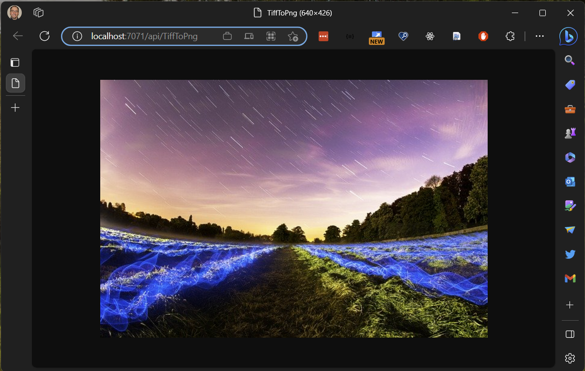

# Tiff-Convert-Demo
This is a sample HTTP triggered Azure Function that uses Magick.NET nuget package to convert a .tiff image file to a PNG image. The response back from the HTTP call will be the png image.

## Dev Setup
1. Install Azure Function Core Tools
1. Clone this repo to your machine.
1. run `dotnet restore` then run `func start`

